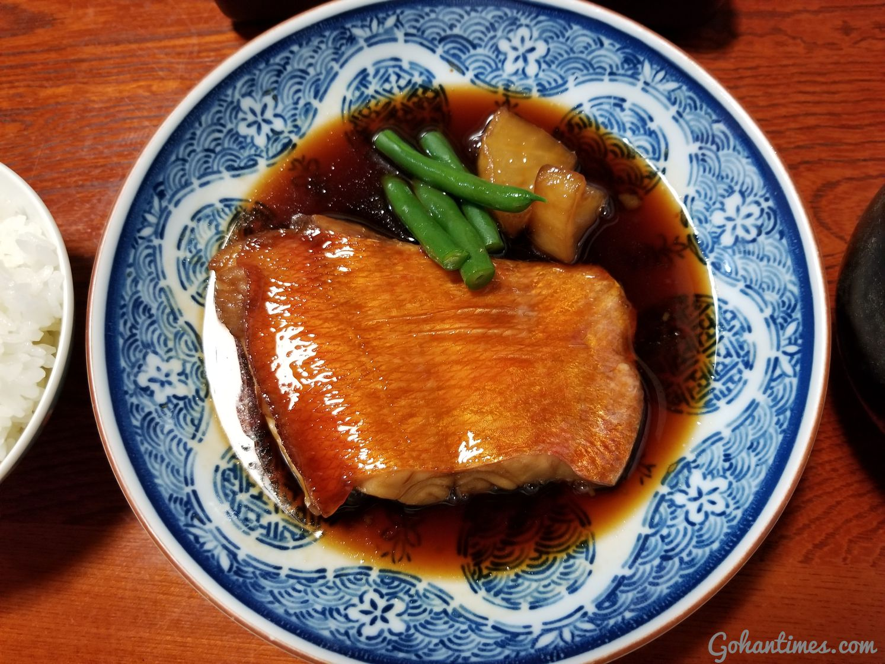
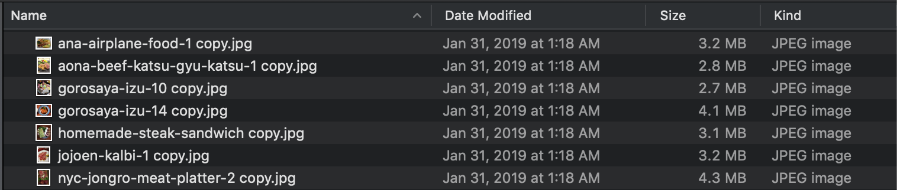
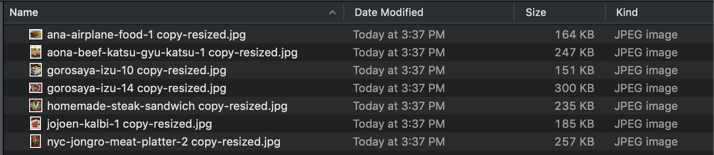

# Gohanties.com Image Processing Program
### At this moment this program/script is run on my local machine. Development of a web application using Flask is currently underway.
Update : 2/9/19 -added compatibility with multiple font files(.ttf or .otf)
## Main Overview: 
#### This program was developed in an effort to automate an image processing procedure that I have to go through every image used in my blog, [Gohantimes.com](https://www.gohantimes.com) . In short, this program will take raw .jpg image files in a given directory and resize, compress, and watermark every photo to be blog-upload ready. 

## Problem To Solve
Most images posted on the web require some degree of processing before it can be uploaded. Images uploaded online typically need to be resized, compressed and often watermarked. Manual processing of this process typically entails using multiple sites to resize and compress, and using a photo editing application to watermark the image. Often times, this can only be done in small quatities and creates a lot of repetitive work. I had over 1000+ photos, so the manual process is too time consuming for me.
## Solution
Automate the process! I wrote this program in python to automatically resize, compress, and watermark my images. This program achieved the desired result for gohantimes.com, a food a lifestyle blog. An example is shown below
## Example
The watermark refers to a URL tag placed on the bottom right corner of every image.(3 font examples)

### Original Image Size : 4.1MB    Original Image Dimensions: 4032px × 3024px

### New Image Size : 299KB    New Image Dimensions: 1493px × 1120px

### Example folder (Before, after)
Before : 

After : 

